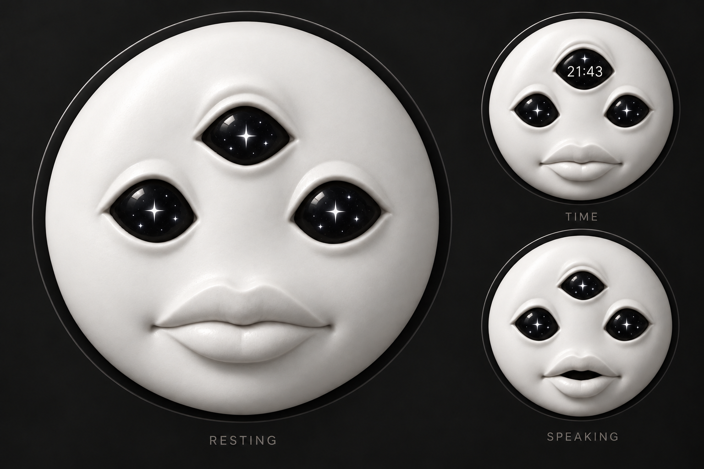

# Oracle

A circular white sculptural face with three glossy black eyes, animated stars, and carved lips. Developed as a character for a round SuperClock display.

[Preview](index.html) · [Editable study](../../studies/oracle.fragment.html) · [Character manifest](character.json) · [Image-generation prompt](provenance/image-generation.md)

## Visual identity

- Smooth neutral white statue material, with volume from lighting and relief.
- No marble veins, cracks, sketch outlines, or colored surface patterns.
- Exactly three eyes: one centered on the forehead and two below.
- Black eye interiors with shimmering white stars or state-specific luminous shapes.
- Sculpted lips, slight asymmetry, and no nose, ears, hair, neck, or body.

## States

| State | Expression and eye treatment |
| --- | --- |
| Resting | Softly shimmering stars and occasional blinks |
| Curious | Uneven eye opening, sideways glance, asymmetric lips |
| Happy | Raised mouth corners and luminous hearts |
| Delighted | Bigger smile and large starbursts |
| Surprised | Wide eyes, oversized stars, open lips |
| Sleepy | Heavy eyelids, dim crescent moons |
| Annoyed | Narrow, angled eyes and sharp diamonds |
| Sad | Downturned lips and faint, lowered stars |
| Listening | Attentive eyes and a gentle pulse around the stars |
| Thinking | Orbiting points and an uneven gaze |
| Speaking | Moving lips and shifting stars; silent |
| Focus | Steady diamonds and a concentrated gaze |
| Time | Browser-local time in the forehead eye |
| Alarm | Alert eyes and bright starbursts; silent |

The preview offers direct selection, an automatic sequence, Next state, Pause/Play, and Blink. Expressions blend between poses. Reduced-motion preferences start playback paused. The browser remembers the selected state and pause setting locally.

## Implementation and limits

The preview deforms the generated artwork with a WebGL shader. Eye symbols and their shimmer are drawn procedurally; the character is not a rigged 3D model. Edit the pose definitions in `studies/oracle.fragment.html`, then run `npm run build`. The generated `index.html`, `index.css`, and `index.js` files are outputs. The character manifest lists the supported state IDs and meanings.

Speaking is a silent motion study, with no audio or lip synchronization. Listening, thinking, focus, and alarm are visual demonstrations, with no assistant-event integration. Hardware fit and performance on the final round display have not been established.

The source image is stored as [the concept sheet](assets/concept-sheet.png), with a JPEG runtime copy at [oracle-source.jpg](assets/oracle-source.jpg). The shader samples the large resting face from that sheet. Preserve its dimensions and composition unless the sampling coordinates are updated.

## Local review

Serve the repository as described in the root README, then open `/characters/oracle/`. Run `npm run check` and `npm test` after changes. Check all states, motion, transitions, keyboard controls, Pause/Play, and the layout at 320px width. Test the final device separately before treating the prototype as a hardware implementation.

## Completed assistant motion vocabulary

Oracle retains the fourteen original looks and adds twenty expression, activity and operational modes. Activity and Emotion are now separate controls: try Working + Happy or Researching + Concerned. The original emotion choices in Preview remain available for comparison.

The added performances are starting (staggered eye opening), researching (reading sweeps), working and coding (distinct fixation rhythms), checking (left/right comparison), waiting (one patient glance), needs input (questioning forehead eye), complete (one starburst acknowledgement then rest), error (brief concerned shake), and sleeping (fully closed eyes). Confused, Concerned and Playful extend the expression palette. Offline, reconnecting, awaiting approval, permission denied, paused, stopped and partly done have explicit labels and restrained reusable poses. They are manually selected simulations; no task outcome or connection is inferred.

Play expression runs a 2.8-second temporary expression and returns to the current activity. Changing activity interrupts it immediately. Sleeping closes all eyes regardless of a selected expression. Complete keeps its label after the one-shot motion settles. Reduced motion pauses a running preview when enabled; manual Play remains available.

`oraclePreview` exposes `setMode(id)`, `setEmotion(id)`, `react(emotionId)`, `setPaused(boolean)`, `seek(seconds)`, `getState()` and `capture()`. Seeking is relative to the selected activity for deterministic review. Accepted aliases: idle/resting, waking/starting, searching/researching, answering/speaking, success/complete and approval/awaiting-approval. The character manifest lists all canonical modes and expression-layer IDs.

Run `npm test` for the original visual checks plus new activity poses, time-separated performances, expression combinations, reaction interruption/return, operational labels, live reduced-motion changes and small-screen layout.
